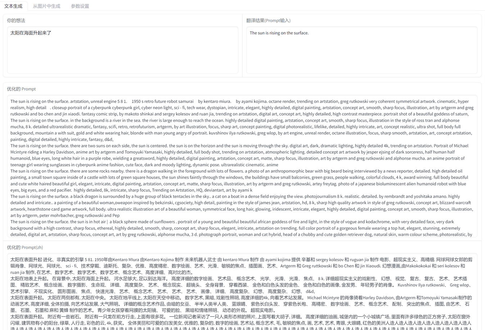
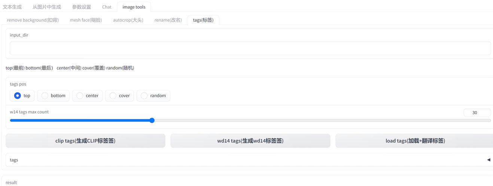
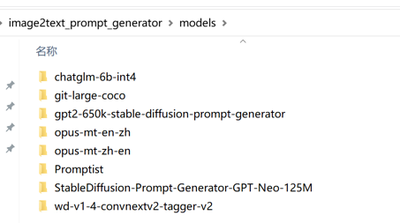

# Image2text Prompt Generator

## README Translation

-   [English](README.en.md)
-   [Simplified Chinese](README.md)
-   [Japanese](README.ja.md)

## introduce

Prompt generator

Supports parsing prompt descriptions from images, and can be extended based on descriptions for secondary image generation.
Support Chinese through[ChatGLM](https://github.com/THUDM/ChatGLM-6B)扩展出Prompt描述。

✅ Models used in this project

> All models are lazy loaded, downloaded and loaded only when used, and will not occupy video memory.

-   graphic text
    -   [SmilingWolf/wd-v1-4-swinv2-tagger-v2](https://huggingface.co/SmilingWolf/wd-v1-4-swinv2-tagger-v2)
    -   [ViT-H-14/laion2b_s32b_b79k](https://huggingface.co/ViT-H-14/laion2b_s32b_b79k)
    -   [microsoft/git-large-coco](https://huggingface.co/microsoft/git-large-coco)

-   Wen Shengwen
    -   stable diffusion
        -   [Ar4ikov/gpt2-650k-stable-diffusion-prompt-generator](https://huggingface.co/Ar4ikov/gpt2-650k-stable-diffusion-prompt-generator)
    -   midjourney
        -   [succinctly/text2image-prompt-generator](https://huggingface.co/succinctly/text2image-prompt-generator)
    -   universal
        -   [Drishti Sharma/Stable Diffusion-Prompt-Generator-GPT-Neo-125M](https://huggingface.co/DrishtiSharma/StableDiffusion-Prompt-Generator-GPT-Neo-125M)
        -   [microsoft/Promptist](https://huggingface.co/microsoft/Promptist)

-   Chinese extension[ChatGLM-6B](https://github.com/THUDM/ChatGLM-6B)

-   translate
    -   [Helsinki-NLP/opus-mt-en-zh](https://huggingface.co/Helsinki-NLP/opus-mt-en-zh)
    -   [Helsinki-NLP/opus-mt-zh-en](https://huggingface.co/Helsinki-NLP/opus-mt-zh-en)

🚩 This project exists independently and is not integrated into[automatic111/webui](https://github.com/AUTOMATIC1111/stable-diffusion-webui), which is convenient to close at any time to save video memory.

-   online demo[hug face demo](https://huggingface.co/spaces/hahahafofo/image2text_prompt_generator)
-   Graphics and text functions require GPU deployment
-   Some models use CPU (translation, Wen Shengwen) to prevent GPU memory overflow
-   support`stable diffusion`and`midjourney`two`prompt`Generation method
-   use[ChatGlam-6B-Net4](https://huggingface.co/THUDM/chatglm-6b-int4)save video memory

## One key package

### Baidu cloud disk download

The ChatGLM model needs to be downloaded separately (download the int4 version), and put it under the models directory of the program

-   [v1.0](https://pan.baidu.com/s/1pKtpPmiuliX7rf0z-5HY_w?pwd=79sk)Extraction code: 79sk
-   [v1.5](https://pan.baidu.com/s/1vMzDGbtTO0-CD7wk-4GrcQ?pwd=eb33)Extraction code: eb33
-   [v1.8](https://pan.baidu.com/s/1bup8Oa56e_S4andbU8wk0g?pwd=7hbt)Extract code: 7hbt
-   [offline model](https://pan.baidu.com/s/1_Hs-MRjSxg0gaIRDaUTD8Q?pwd=6ti4)Extraction code: 6ti4

### starting program

-   `webui.bat`The main function
-   `webui_chat.bat`Main function +chatGLM chat interface
-   `webui_imagetools.bat`image processing tools
-   `webui_offline.bat`use offline mode
    -   Revise`settings.offline.toml`inside the model path
    -   Model`git clone`arrive`models`Directory (cannot be copied directly from cache)
-   `webui_venv.bat`Install it manually`venv`Environment, start with this, default`venv`Table of contents.
-   The first run will automatically download the model, and the default download is in the user directory`.cache/huggingface`
    > > > > > > > main

### starting program

-   `webui.bat`The main function
-   `webui_chat.bat`Main function +chatGLM chat interface
-   `webui_imagetools.bat`image processing tools
-   `webui_offline.bat`use offline mode
    -   Revise`settings.offline.toml`inside the model path
    -   Model`git clone`arrive`models`Directory (cannot be copied directly from cache)
-   `webui_venv.bat`Install it manually`venv`Environment, start with this, default`venv`Table of contents.
-   The first run will automatically download the model, and the default download is in the user directory`.cache/huggingface`

### update program

```bash
  cd image2text_prompt_generator
  git pull
```

or`github`Package and download zip, overwrite the program directory

## Configuration and use

<details>
<summary>使用方法</summary>

### prompt optimization model

-   `mircosoft`Generate a simple description (`stable diffusion`)
-   `mj`Generate a random description (`midjourney`)
-   `gpt2 650k`and`gpt_neo_125M`generate more complex descriptions


### Wen Shengwen

-   Chinese to English translation
-   Chinese pass[ChatGlam-6B-Net4](https://huggingface.co/THUDM/chatglm-6b-int4)extended to complex description
-   translate to english
-   Optimize model generation through prompt



### graphic text

-   clip is used for multiple people, complex scenes, high video memory usage (>8G)
-   blip for characters and scenes simple
-   wd14 for figures
-   Prompt generation will automatically merge blip or clip + wd14


## image processing tools

-   Batch buckle background
-   paste face (for refining clothes)
-   Buckle up
-   Batch rename (regular)
-   Tagging (Clip+W14 tagging and translation)



## chatglm generate

### hardware requirements

| **quantization level** | **Minimum GPU memory**(reasoning) | **Minimum GPU memory**(Efficient parameter fine-tuning) |
| ---------------------- | --------------------------------- | ------------------------------------------------------- |
| FP16 (no quantization) | 13 GB                             | 14 GB                                                   |
| INT8                   | 8 GB                              | 9 GB                                                    |
| INT4                   | 6 GB                              | 7 GB                                                    |


## browser plug-in

from`chatGPTBox`Project, modify some prompt words

-   use`api.bat`start up

-   configuration`chatGPTBox`Plugins for custom models`http://localhost:8000/chat/completions`

-   exist[release](https://github.com/zhongpei/image2text_prompt_generator/releases)Download the plugin inside

-   [Modified plugin](https://github.com/zhongpei/chatGPTBox)

### browser load plugin


## limit

-   not support`cuda`, it is not recommended to use clip
-   Video memory &lt;6G, it is not recommended to use ChatGLM

</details>

<details>
<summary>配置文件</summary>

### configuration file

`settings.toml`

```toml
[server]
port = 7869 # 端口
host = '127.0.0.1' # 局域网访问需要改成 "0.0.0.0"
enable_queue = true # chat功能需要开启，如错误，需要关闭代理
queue_size = 10
show_api = false
debug = true

[chatglm]
model = "THUDM/chatglm-6b-int4" # THUDM/chatglm-6b-int4 THUDM/chatglm-6b-int8 THUDM/chatglm-6b

# 本地模型
# model = "./models/chatglm-6b-int8" 

device = "cuda" # cpu mps cuda
enable_chat = false # 是否启用聊天功能
local_files_only = false # 是否只使用本地模型
```

## offline model

Please refer to[ChatGLM local load model](https://github.com/THUDM/ChatGLM-6B#从本地加载模型)Model`git clone`arrive`models`directory (not directly from`cache`copy), then modify the`settings-offline.toml`inside the model path

-   The windows path is best to use an absolute path, do not contain Chinese
-   linux/mac paths can use relative paths
-   Model Directory Structure Reference



`settings-offline.toml`

```toml
[generator]
enable = true # 是否启用generator功能
device = "cuda" # cpu mps cuda
fix_sd_prompt = true # 是否修复sd prompt
# models
microsoft_model = "./Promptist"
gpt2_650k_model = "./gpt2-650k-stable-diffusion-prompt-generator"
gpt_neo_125m_model = "./StableDiffusion-Prompt-Generator-GPT-Neo-125M"
mj_model = "./text2image-prompt-generator"
local_files_only = true # 是否只使用本地模型


[translate]
enable = true # 是否启用翻译功能
device = "cuda" # cpu mps cuda
local_files_only = true # 是否只使用本地模型
zh2en_model = "./models/opus-mt-zh-en"
en2zh_model = "./models/opus-mt-en-zh"

cache_dir = "./data/translate_cache" # 翻译缓存目录

[chatglm]
# 本地模型 https://github.com/THUDM/ChatGLM-6B#从本地加载模型
model = ".\\models\\chatglm-6b-int4" # ./chatglm-6b-int4 ./chatglm-6b-int8 ./chatglm-6b
## windows 绝对路径配置方法
# model = "E:\\zhangsan\\models\\chatglm-6b-int4" 
device = "cuda" # cpu mps cuda
enable_chat = true # 是否启用聊天功能
local_files_only = true # 是否只使用本地模型


```

## hg cache configuration

To prevent the c drive from being full, it can be configured`cache`directory to another disk


</details>

<details>
<summary>手动安装</summary>

## manual installation

First, make sure your computer has the`Python3.10`. If you have not installed
Python, go to the official site (<https://www.python.org/downloads/）下载并安装最新版本的>`Python3.10`.
Next, download and unzip our tools installation package.
Open the command line window (Windows users can press Win + R keys, enter "cmd" in the run box and press Enter to open the command line window), and enter the directory where the tool installation package is located.
Enter the following command in a command line window to install the required dependencies:

```bash
git clone https://huggingface.co/spaces/hahahafofo/image2text_prompt_generator
cd image2text_prompt_generator

# 建立虚拟环境
python -m "venv" venv
# 激活环境 linux & mac 
./venv/bin/activate
# 激活环境 windows
.\venv\Scripts\activate


# gpu 加速
pip install torch==2.0.0+cu118 torchvision==0.15.1+cu118 --extra-index-url https://download.pytorch.org/whl/cu118

pip install --upgrade -r requirements.txt
  
```

This will automatically install the required Python dependencies.
Once installed, you can start the tool by running:

```bash
# 激活环境 linux & mac
./venv/bin/activate
# 激活环境 windows
.\venv\Scripts\activate

# 运行程序
python app.py
    
```

This will launch the tool and open the tool's home page in your browser. If your browser does not open automatically, please manually enter the following URL: http&#x3A;//localhost:7869/
The tools are now successfully installed and started. You can follow the tool's documentation to start using it to process your image data.

</details>

## Update information

-   v2.0 LangChain (local file question and answer)
-   v1.8 labeling tool
-   v1.7 translate local tag cache, translation cache, API
-   v1.6 picture tools
-   v1.5 add chatGLM model
-   v1.0 add webui

## plan

-   [x] web
-   [x] configuration file
-   [x] image2text
    -   [x] clip
    -   [x] blip
    -   [x] wd14
-   [x] text2text
    -   [x] ChatGLM
    -   [x] gpt2 650k
    -   [x] gpt_neo_125M
    -   [x] mj
-   [x] cutout tool
    -   [x] cut background
    -   [x] pick people's heads
    -   [x] 遮挡人物脸部
    -   [x] Modify file names in batches
    -   [x] Load catalog tags and translate
-   [x] translate
    -   [x] f2men, men2f
    -   [x] WD14 tags translation local cache
    -   [x] translation cache
-   [ ] Label
    -   [x] clip + w14 mixed batch image tags
-   [x] LangChain
    -   [x] index
    -   [x] question and answer
