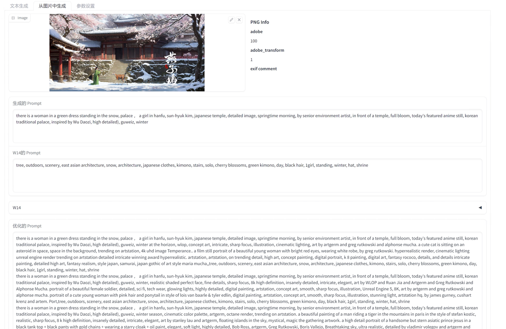
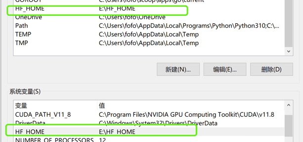

# Image2text プロンプト ジェネレータ

## README 翻訳

-   [英語](README.en.md)
-   [簡体字中国語](README.md)
-   [日本](README.ja.md)

## 導入

プロンプトジェネレーター

イメージからのプロンプトの説明の解析をサポートし、セカンダリ イメージ生成の説明に基づいて拡張できます。
を通じて中国語をサポート[ChatGLM](https://github.com/THUDM/ChatGLM-6B)プロンプトの説明を拡張します。

✅ このプロジェクトで使用されるモデル (すべてのモデルは遅延ロードされ、ダウンロードされ、使用される場合にのみロードされます)

-   グラフィックテキスト
    -   [笑顔のオオカミ/wd-v1-4-swinv2-tagger-v2](https://huggingface.co/SmilingWolf/wd-v1-4-swinv2-tagger-v2)
    -   [ViT-H-14/laion2b_s32b_b79k](https://huggingface.co/ViT-H-14/laion2b_s32b_b79k)
    -   [microsoft/git-large-coco](https://huggingface.co/microsoft/git-large-coco)

-   文生文
    -   安定した拡散
        -   [Ar4ikov/gpt2-650k-stable-diffusion-prompt-generator](https://huggingface.co/Ar4ikov/gpt2-650k-stable-diffusion-prompt-generator)
    -   途中
        -   [簡潔に/text2image-prompt-generator](https://huggingface.co/succinctly/text2image-prompt-generator)
    -   通用
        -   [Drishti Sharma/Stable Diffusion-Prompt-Generator-GPT-Neo-125M](https://huggingface.co/DrishtiSharma/StableDiffusion-Prompt-Generator-GPT-Neo-125M)
        -   [マイクロソフト/プロンプティスト](https://huggingface.co/microsoft/Promptist)

-   中文扩写[チャットGLM-6B](https://github.com/THUDM/ChatGLM-6B)

-   翻訳
    -   [ヘルシンキ-NLP/opus-mt-en-zh](https://huggingface.co/Helsinki-NLP/opus-mt-en-zh)
    -   [ヘルシンキ-NLP/opus-mt-zh-en](https://huggingface.co/Helsinki-NLP/opus-mt-zh-en)

🚩 このプロジェクトは独立して存在し、統合されていません[自動111/webui](https://github.com/AUTOMATIC1111/stable-diffusion-webui)、ビデオメモリを節約するためにいつでも閉じるのに便利です。

-   オンラインデモ[ハグフェイスのデモ](https://huggingface.co/spaces/hahahafofo/image2text_prompt_generator)
-   グラフィックおよびテキスト機能には GPU の導入が必要です
-   一部のモデルでは、GPU のメモリ オーバーフローを防止するために CPU (翻訳、Wen Shengwen) を使用します。
-   安定した拡散と旅の途中の2つの迅速な生成方法をサポート
-   使用[ChatGlam-6B-Net4](https://huggingface.co/THUDM/chatglm-6b-int4)ビデオメモリを節約

## ワンキーパッケージ

### Baidu クラウド ディスク ダウンロード

ChatGLM モデルは別途ダウンロード (int4 バージョンをダウンロード) し、プログラムのモデル ディレクトリに配置する必要があります。

-   [v1.0](https://pan.baidu.com/s/1pKtpPmiuliX7rf0z-5HY_w?pwd=79sk)抽出コード: 79sk
-   [v1.5](https://pan.baidu.com/s/1vMzDGbtTO0-CD7wk-4GrcQ?pwd=eb33)抽出コード: eb33
-   [v1.8](https://pan.baidu.com/s/1bup8Oa56e_S4andbU8wk0g?pwd=7hbt)抽出コード: 7hbt
-   [ChatGLM模型](https://pan.baidu.com/s/1_Hs-MRjSxg0gaIRDaUTD8Q?pwd=6ti4)抽出コード: 6ti4

### 更新プログラム

```bash
cd image2text_prompt_generator
git pull
```

または github パッケージをダウンロードし、プログラム ディレクトリをカバーする zip をダウンロードします。

### プログラムの開始

-   webui.bat の主な機能
-   webui_chat.bat メイン関数 +chatGLM チャット インターフェイス
-   webui_imagetools.bat 画像処理ツール
-   webui_offline.bat はオフライン モードを使用します
    -   settings.offline.toml のモデル パスを変更します。
    -   モデル ディレクトリへのモデルの git clone (キャッシュから直接コピーすることはできません)
-   webui_venv.bat 自分で venv 環境を手動でインストールします。これを使用して、デフォルトの venv ディレクトリを起動します。
-   最初の実行でモデルが自動的にダウンロードされ、デフォルトのダウンロードはユーザー ディレクトリ .cache/huggingface にあります。

## 使い方

### 迅速な最適化モデル

-   microsoft は簡単な説明を生成します (安定した拡散)
-   mj ランダムな説明を生成する (旅の途中)
-   gpt2 650k と gpt_neo_125M は、より複雑な記述を生成します


### 文生文

-   中国語から英語への翻訳
-   中国パス[ChatGlam-6B-Net4](https://huggingface.co/THUDM/chatglm-6b-int4)複雑な記述に拡張
-   英語に翻訳する
-   プロンプトによるモデル生成の最適化


### グラフィックテキスト

-   クリップは、複数の人、複雑なシーン、高いビデオ メモリ使用量 (>8G) に使用されます。
-   文字とシーンの単純なブリップ
-   フィギュア用のwd14
-   プロンプト生成により、ブリップまたはクリップ + wd14 が自動的にマージされます



## 画像処理ツール

-   バッチ バックルの背景
-   顔のり（服のリファイン用）
-   シートベルトを締める
-   一括リネーム（通常）
-   タグ付け (クリップ + W14 タグ付けと翻訳)


## chatglm 生成

### ハードウェア要件

| **量子化レベル**   | **最小 GPU メモリ**（推理） | **最小 GPU メモリ**（効率的なパラメータ微調整） |
| ------------ | ------------------ | ---------------------------- |
| FP16 (量子化なし) | 13GB               | 14GB                         |
| INT8         | 8GB                | 9GB                          |
| INT4         | 6GB                | 7GB                          |


## 構成ファイル (settings.toml)

を参照してください。[ChatGLM はモデルをローカルに読み込みます](https://github.com/THUDM/ChatGLM-6B#从本地加载模型)

```toml
[server]
port = 7869 # 端口
host = '127.0.0.1' # 局域网访问需要改成 "0.0.0.0"
enable_queue = true # chat功能需要开启，如错误，需要关闭代理
queue_size = 10
show_api = false
debug = true

[chatglm]
model = "THUDM/chatglm-6b-int4" # THUDM/chatglm-6b-int4 THUDM/chatglm-6b-int8 THUDM/chatglm-6b

# 本地模型
# model = "./models/chatglm-6b-int8" 

device = "cuda" # cpu mps cuda
enable_chat = false # 是否启用聊天功能
local_files_only = false # 是否只使用本地模型
```

## オフライン モデル

モデル ディレクトリに git clone し (キャッシュから直接コピーすることはできません)、settings-offline.toml でモデル パスを変更します。

-   Windows パスは絶対パスを使用するのが最適です。中国語を含めないでください。
-   linux/mac パスは相対パスを使用できます
-   モデル ディレクトリ構造リファレンス

```toml
[generator]
enable = true # 是否启用generator功能
device = "cuda" # cpu mps cuda
fix_sd_prompt = true # 是否修复sd prompt
# models
microsoft_model = "./Promptist"
gpt2_650k_model = "./gpt2-650k-stable-diffusion-prompt-generator"
gpt_neo_125m_model = "./StableDiffusion-Prompt-Generator-GPT-Neo-125M"
mj_model = "./text2image-prompt-generator"
local_files_only = true # 是否只使用本地模型


[translate]
enable = true # 是否启用翻译功能
device = "cuda" # cpu mps cuda
local_files_only = true # 是否只使用本地模型
zh2en_model = "./models/opus-mt-zh-en"
en2zh_model = "./models/opus-mt-en-zh"

cache_dir = "./data/translate_cache" # 翻译缓存目录

[chatglm]
# 本地模型 https://github.com/THUDM/ChatGLM-6B#从本地加载模型
model = ".\\models\\chatglm-6b-int4" # ./chatglm-6b-int4 ./chatglm-6b-int8 ./chatglm-6b
device = "cuda" # cpu mps cuda
enable_chat = true # 是否启用聊天功能
local_files_only = true # 是否只使用本地模型


```

# インストール

まず、コンピューターに Python 3 がインストールされていることを確認します。 Python をインストールしていない場合は、公式サイト ([https://www.python.org/downloads/) から最新バージョンをダウンロードしてインストールします。](https://www.python.org/downloads/）下载并安装最新版本的)パイソン3.
次に、ツールのインストール パッケージをダウンロードして解凍します。
コマンド ライン ウィンドウを開き (Windows ユーザーは Win + R キーを押して、実行ボックスに「cmd」と入力し、Enter キーを押してコマンド ライン ウィンドウを開きます)、ツールのインストール パッケージが配置されているディレクトリを入力します。
コマンド ライン ウィンドウに次のコマンドを入力して、必要な依存関係をインストールします。

```bash
git clone https://huggingface.co/spaces/hahahafofo/image2text_prompt_generator
cd image2text_prompt_generator

# 建立虚拟环境
python -m "venv" venv
# 激活环境 linux & mac 
./venv/bin/activate
# 激活环境 windows
.\venv\Scripts\activate


# gpu 加速
pip install torch==2.0.0+cu118 torchvision==0.15.1+cu118 --extra-index-url https://download.pytorch.org/whl/cu118

pip install --upgrade -r requirements.txt
  
```

これにより、必要な Python 依存関係が自動的にインストールされます。
インストールしたら、次のコマンドを実行してツールを起動できます。

```bash
# 激活环境 linux & mac
./venv/bin/activate
# 激活环境 windows
.\venv\Scripts\activate

# 运行程序
python app.py
    
```

これにより、ツールが起動し、ブラウザでツールのホームページが開きます。ブラウザが自動的に開かない場合は、次の URL を手動で入力してください: http&#x3A;//localhost:7860/
ツールが正常にインストールされ、開始されました。ツールのドキュメントに従って、ツールを使用して画像データを処理することができます。

## ブラウザプラグイン

chatGPTBox プロジェクトから、いくつかのプロンプト ワードを変更します

-   api.bat から始めます
-   chatGPTBox プラグインをカスタム モデル http&#x3A;//localhost:8000 として構成します。
-   リリースでプラグインをダウンロードする

## hg cache 配置

c ドライブがいっぱいになるのを防ぐために、キャッシュ ディレクトリを他のドライブに設定できます。



## 限界

-   cuda はサポートされておらず、clip は推奨されていません
-   ビデオ メモリ &lt;6G、ChatGLM の使用は推奨されません

## 更新情報

-   v1.8 ラベル付けツール
-   v1.7 翻訳ローカル タグ キャッシュ、翻訳キャッシュ、API
-   v1.6 画像ツール
-   v1.5 chatGLM モデルを追加
-   v1.0 追加 webui

## プラン

-   [x] ウェブ
-   [x] 構成ファイル
-   [x] 画像2文字
    -   [x] クリップ
    -   [x] ブリップ
    -   [x] wd14
-   [x] テキスト2テキスト
    -   [x] ChatGLM
    -   [x] gpt2 650k
    -   [x] gpt_neo_125M
    -   [x] mj
-   [x] 切り抜きツール
    -   [x] 背景を切り取る
    -   [x] 人々の頭を選ぶ
    -   [x] 人の顔を覆う
    -   [x] ファイル名をバッチで変更する
    -   [x] カタログタグを読み込んで翻訳する
-   [x] 翻訳
    -   [x] f2men、men2f
    -   [x] WD14 タグ変換ローカル キャッシュ
    -   [x] 翻訳キャッシュ
-   [ ] ラベル
    -   [x] クリップ + w14 混合バッチ画像タグ
