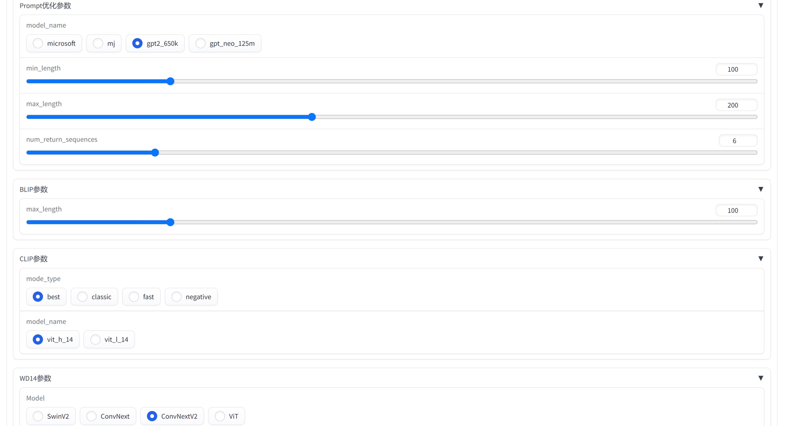
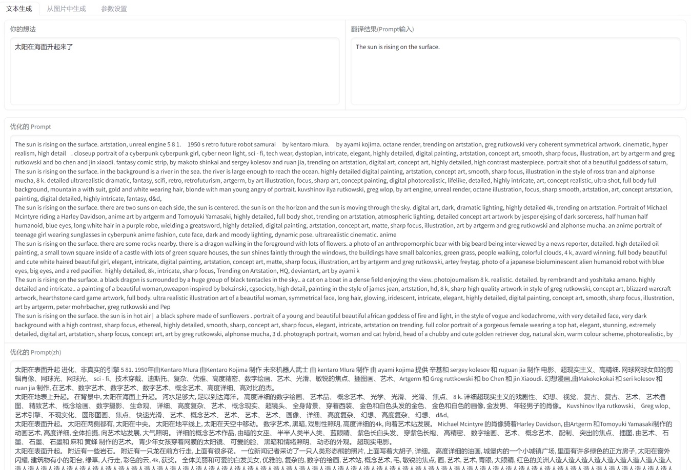
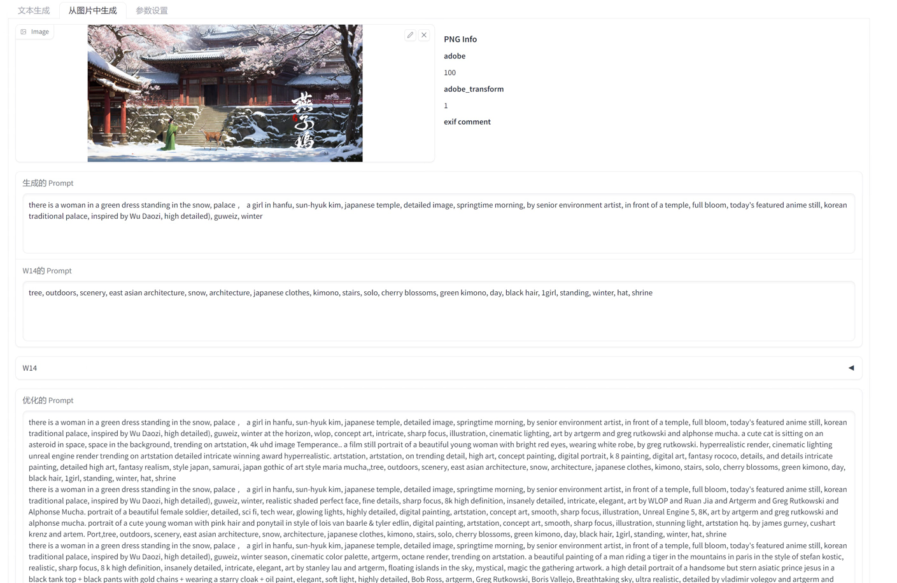
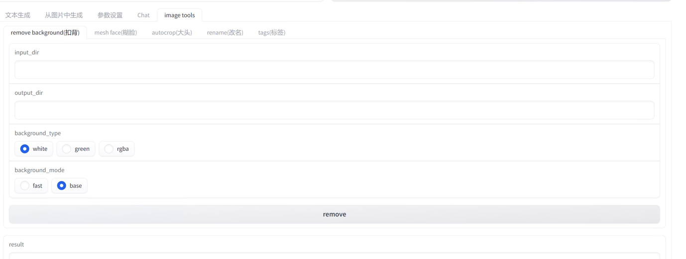
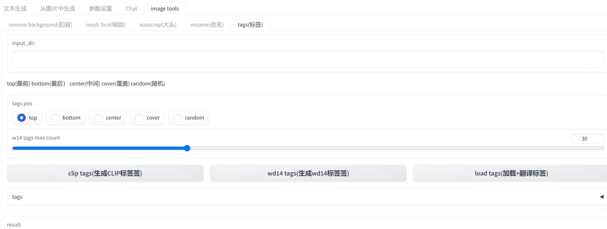
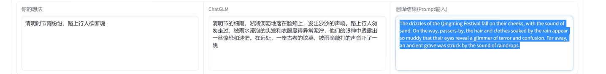
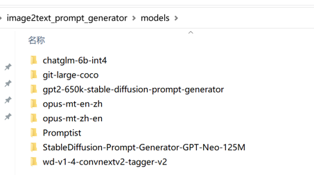

# Image2text Prompt Generator

## 介绍

Prompt 生成器

支持从图片中解析出 Prompt 描述，并能够基于描述进行扩展，以便进行二次图片生成。
支持中文通过[ChatGLM](https://github.com/THUDM/ChatGLM-6B)扩展出Prompt描述。

✅ 本项目中使用模型(所有模型都是惰性加载，使用才进行下载和加载)

* 图生文
    * [SmilingWolf/wd-v1-4-swinv2-tagger-v2](https://huggingface.co/SmilingWolf/wd-v1-4-swinv2-tagger-v2)
    * [ViT-H-14/laion2b_s32b_b79k](https://huggingface.co/ViT-H-14/laion2b_s32b_b79k)
    * [microsoft/git-large-coco](https://huggingface.co/microsoft/git-large-coco)

* 文生文
    * stable diffusion
        * [Ar4ikov/gpt2-650k-stable-diffusion-prompt-generator](https://huggingface.co/Ar4ikov/gpt2-650k-stable-diffusion-prompt-generator)
    * midjourney
        * [succinctly/text2image-prompt-generator](https://huggingface.co/succinctly/text2image-prompt-generator)
    * 通用
        * [DrishtiSharma/StableDiffusion-Prompt-Generator-GPT-Neo-125M](https://huggingface.co/DrishtiSharma/StableDiffusion-Prompt-Generator-GPT-Neo-125M)
        * [microsoft/Promptist](https://huggingface.co/microsoft/Promptist)

* 中文扩写 [ChatGLM-6B](https://github.com/THUDM/ChatGLM-6B)
* 翻译
    * [Helsinki-NLP/opus-mt-en-zh](https://huggingface.co/Helsinki-NLP/opus-mt-en-zh)
    * [Helsinki-NLP/opus-mt-zh-en](https://huggingface.co/Helsinki-NLP/opus-mt-zh-en)

🚩 本项目独立存在，没有集成到[automatic111/webui](https://github.com/AUTOMATIC1111/stable-diffusion-webui)，便于随时关闭节省显存。

* 在线演示 [拥抱脸Demo](https://huggingface.co/spaces/hahahafofo/image2text_prompt_generator)
* 图生文功能需要GPU部署
* 部分模型使用CPU（翻译、文生文），防止GPU显存溢出
* 支持stable diffusion和midjourney两种prompt生成方式
* 使用[ChatGLM-6b-int4](https://huggingface.co/THUDM/chatglm-6b-int4)节省显存

## 一键包

### 百度云盘下载

ChatGLM 模型需要单独下载(下载int4版本)，放到程序目录 models 下面

* [v1.0](https://pan.baidu.com/s/1pKtpPmiuliX7rf0z-5HY_w?pwd=79sk) 提取码: 79sk
* [v1.5](https://pan.baidu.com/s/1vMzDGbtTO0-CD7wk-4GrcQ?pwd=eb33) 提取码: eb33
* [开发版](https://pan.baidu.com/s/1w1D3PdJjn3iOQFap4a-hWg?pwd=x964) 提取码: x964
* [ChatGLM模型](https://pan.baidu.com/s/1_Hs-MRjSxg0gaIRDaUTD8Q?pwd=6ti4) 提取码: 6ti4

### 更新程序
```bash
cd image2text_prompt_generator
git pull
```

或github打包下载zip，覆盖程序目录


### 启动程序 

* webui.bat 主要功能
* webui_chat.bat  主要功能+chatGLM聊天界面
* webui_imagetools.bat 图片处理工具
* webui_offline.bat 使用离线模式
  * 修改settings.offline.toml里面的模型路径
  * 模型git clone到models目录（不能直接从cache拷贝）
* webui_venv.bat 自己手动安装venv环境，用这个启动，默认venv目录。
* 第一次运行会自动下载模型，默认下载在用户目录.cache/huggingface

## 使用方式

### prompt优化模型

* mircosoft 生成简单描述 (stable diffusion)
* mj 生成随机描述 (midjourney)
* gpt2 650k 和 gpt_neo_125M 生成更复杂的描述



### 文生文

* 中文翻译到英文
* 中文通过[ChatGLM-6b-int4](https://huggingface.co/THUDM/chatglm-6b-int4)扩写为复杂描述
* 翻译为英文
* 通过prompt优化模型生成



### 图生文

* clip 用于 多人，场景复杂,占用显存高(>8G)
* blip 用于 人物和场景简单
* wd14 用于 人物
* prompt 生成会自动合并 blip或clip + wd14



## 图片处理工具
* 批量扣背景
* 糊脸（炼衣服用）
* 扣大头
* 批量改名（正则）
* 打标签 （Clip+W14标签和翻译）




## chatglm 生成

### 硬件需求

| **量化等级**  | **最低 GPU 显存**（推理） | **最低 GPU 显存**（高效参数微调） |
|-----------|-------------------|-----------------------|
| FP16（无量化） | 13 GB             | 14 GB                 |
| INT8      | 8 GB              | 9 GB                  |
| INT4      | 6 GB              | 7 GB                  |



## 配置文件 (settings.toml)

请参考 [ChatGLM本地加载模型](https://github.com/THUDM/ChatGLM-6B#从本地加载模型)

```toml
[server]
port = 7869 # 端口
host = '127.0.0.1' # 局域网访问需要改成 "0.0.0.0"
enable_queue = true # chat功能需要开启，如错误，需要关闭代理
queue_size = 10
show_api = false
debug = true

[chatglm]
model = "THUDM/chatglm-6b-int4" # THUDM/chatglm-6b-int4 THUDM/chatglm-6b-int8 THUDM/chatglm-6b

# 本地模型
# model = "./models/chatglm-6b-int8" 

device = "cuda" # cpu mps cuda
enable_chat = false # 是否启用聊天功能
local_files_only = false # 是否只使用本地模型
```

## 离线模型

模型git clone到models目录（不能直接从cache拷贝），然后修改settings-offline.toml里面的模型路径
* windows路径最好使用绝对路径，不要包含中文
* linux/mac路径可以使用相对路径
* 模型目录结构参考


```toml
[generator]
enable = true # 是否启用generator功能
device = "cuda" # cpu mps cuda
fix_sd_prompt = true # 是否修复sd prompt
# models
microsoft_model = "./Promptist"
gpt2_650k_model = "./gpt2-650k-stable-diffusion-prompt-generator"
gpt_neo_125m_model = "./StableDiffusion-Prompt-Generator-GPT-Neo-125M"
mj_model = "./text2image-prompt-generator"
local_files_only = true # 是否只使用本地模型


[translate]
enable = true # 是否启用翻译功能
device = "cuda" # cpu mps cuda
local_files_only = true # 是否只使用本地模型
zh2en_model = "./models/opus-mt-zh-en"
en2zh_model = "./models/opus-mt-en-zh"

cache_dir = "./data/translate_cache" # 翻译缓存目录

[chatglm]
# 本地模型 https://github.com/THUDM/ChatGLM-6B#从本地加载模型
model = ".\\models\\chatglm-6b-int4" # ./chatglm-6b-int4 ./chatglm-6b-int8 ./chatglm-6b
device = "cuda" # cpu mps cuda
enable_chat = true # 是否启用聊天功能
local_files_only = true # 是否只使用本地模型


```


# 安装

首先，确保您的计算机已经安装了 Python 3。如果您尚未安装 Python，请前往官方网站（https://www.python.org/downloads/）下载并安装最新版本的
Python 3。
接着，下载并解压缩我们的工具安装包。
打开命令行窗口（Windows 用户可以按下 Win + R 键，在运行框中输入 “cmd” 并按下回车键打开命令行窗口），并进入到工具安装包所在的目录。
在命令行窗口中输入以下命令安装所需的依赖项：

```bash
git clone https://huggingface.co/spaces/hahahafofo/image2text_prompt_generator
cd image2text_prompt_generator

# 建立虚拟环境
python -m "venv" venv
# 激活环境 linux & mac 
./venv/bin/activate
# 激活环境 windows
.\venv\Scripts\activate


# gpu 加速
pip install torch==2.0.0+cu118 torchvision==0.15.1+cu118 --extra-index-url https://download.pytorch.org/whl/cu118

pip install --upgrade -r requirements.txt
  
```

这将自动安装所需的 Python 依赖项。
安装完成后，您可以运行以下命令启动工具：

```bash
# 激活环境 linux & mac
./venv/bin/activate
# 激活环境 windows
.\venv\Scripts\activate

# 运行程序
python app.py
    
```

这将启动工具并在您的浏览器中打开工具的主页。如果您的浏览器没有自动打开，请手动输入以下网址：http://localhost:7860/
工具现在已经成功安装并启动了。您可以按照工具的说明文档，开始使用它来处理您的图片数据。

## 浏览器插件

 来源于 chatGPTBox 项目，修改部分提示词语
* 使用 api.bat 启动
* 配置 chatGPTBox 插件为 自定义模型 http://localhost:8000

## hg cache 配置

防止c盘沾满，可以配置cache目录到其他盘


## 更新信息

* v1.7  翻译本地标签缓存，翻译缓存, API
* v1.6  图片工具 
* v1.5  增加chatGLM模型
* v1.0  增加webui

## 计划

* [X] webui
* [X] 配置文件
* [X] image2text
  * [X] clip
  * [X] blip
  * [X] wd14
* [X] text2text
  * [X] ChatGLM
  * [X] gpt2 650k
  * [X] gpt_neo_125M
  * [X] mj
* [X] 抠图工具
  * [X] 抠背景
  * [X] 抠人物大头
  * [X] 遮挡人物脸部
  * [X] 批量修改文件名
  * [X] 加载目录标签并翻译
* [X] 翻译
  * [X] zh2en,en2zh
  * [X] WD14 tags 翻译本地缓存
  * [X] 翻译缓存
* [ ] 标签
  * [X] clip + w14 混合批量图片标签

